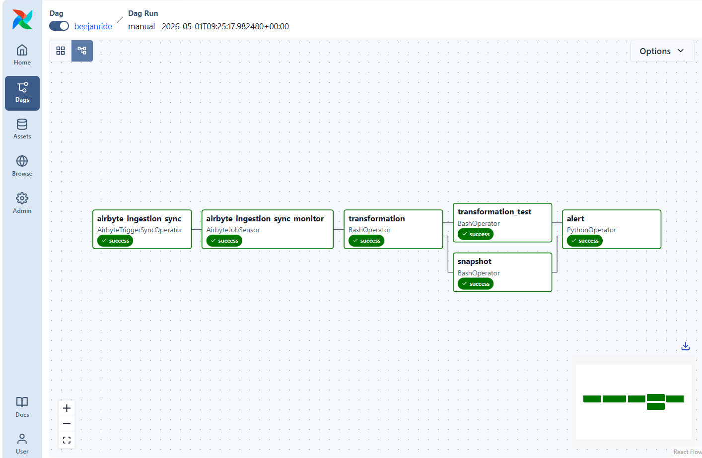
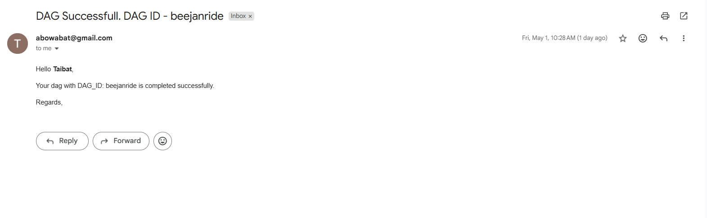
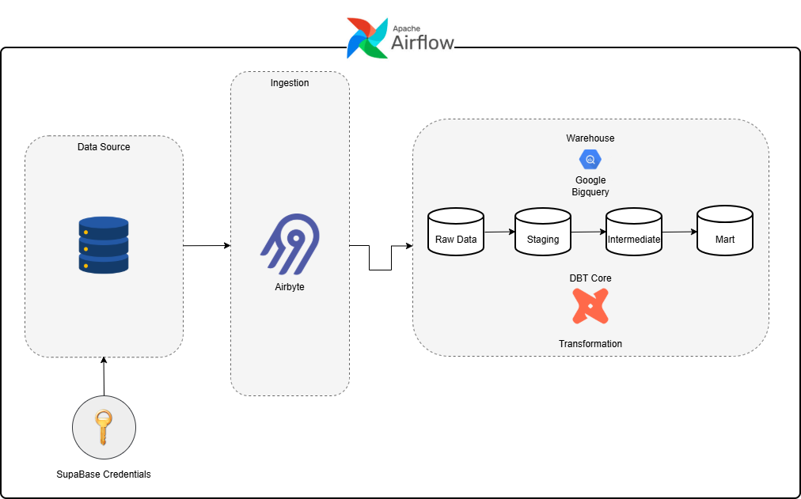

# BeejanRide's ELT Data Platform – From Raw Ride Data to Analytics

## Project Overview

BeejanRide is a fast-growing UK mobility startup operating in five cities, offering services such as ride-hailing, airport transfers, and scheduled corporate rides.

As a newly hired Data Engineer at BeejanRide, my responsibility was to design and implement a **production-ready analytics transformation layer using dbt and orchestrate the workflow to eliminate manual processes** after the company migrated to a modern data stack.

The goal of this project was to build a **scalable, well-tested, and well-documented analytics platform that requires no manual intervention**, enabling reliable reporting and data-driven decision-making.

This project demonstrates how raw operational data is **extracted and ingested into a data warehouse using Airbyte**, then transformed into **clean, trusted analytics models using dbt best practices** such as modular transformations, testing, and documentation, with the entire workflow **orchestrated using Airflow**.

---

## Data Architecture

The project follows a layered modeling approach:

**Sources → Staging → Intermediate → Marts**

* **Sources** represent raw data ingested from operational systems
* **Staging models** clean, standardize, and lightly transform raw tables
* **Intermediate models** implement business logic and reusable transformations
* **Mart models** provide analytics-ready datasets optimized for reporting and business use cases

---

## Data Extraction & Ingestion

Raw operational data from the frontend application database is ingested using **Airbyte** into **Google BigQuery**, which serves as the central data warehouse.

These raw tables are then registered in dbt using **source definitions**, enabling lineage tracking, testing, and documentation within the transformation layer.

---

## Transformation Layer

Using **dbt**, the transformation layer was built to:

* Standardize and clean raw data
* Implement business logic
* Create reusable intermediate models
* Produce analytics-ready data marts

---

Key transformations supports analytical use cases:

* Daily revenue per city
* Gross vs net revenue
* Daily revenue dashboard
* City-level profitability
* Driver leaderboard
* Rider LTV analysis
* Payment reliability report
* Driver activity monitoring
* Surge impact analysis
* Fraud detection insights

---

## Data Quality & Testing

To ensure reliability, multiple **data quality tests** were implemented:

- **Generic Tests:** not_null, unique, relationships, accepted_values
- **Custom Tests:** No negative revenue, trip duration > 0, completed trips must have successful payments
- **Freshness Test:** trips_raw source must be updated within 2 hours

These tests ensure that downstream analytics and reporting rely on **trusted, validated data**.

---

## Snapshot

Snapshots were implemented using **Slowly Changing Dimension Type 2** to track historical changes in the drivers table. This allows changes in driver_status, driver_rating, and vehicle_id to be captured over time, preserving previous values and enabling analysis of how these attributes evolve. 

---

## Orchestration

The end-to-end workflow is orchestrated using Apache Airflow to eliminate manual intervention and ensure reliable pipeline execution.

Airflow is responsible for:

* Triggering data ingestion jobs in Airbyte
* Orchestrating the ingestion of data into Google BigQuery
* Running dbt transformations after successful ingestion
* Executing dbt tests to validate data quality
* Triggering dbt snapshots to implement Slowly Changing Dimension (SCD) Type 2 history tracking
* Managing task dependencies and execution order
* Supporting retries, monitoring, and scheduled runs
* Executing failure callbacks for error handling and sending alerts on successful DAG completion

This orchestration layer ensures a fully automated and production-ready analytics workflow.

---

## Tradoffs

Several tradeoffs were made to ensure data is efficiently ingested, stored, transformed, and orchestrated:

- **Source sync:** The source database was synced using Incremental/Append mode to avoid reloading the entire dataset on every sync, reducing time and compute costs by only processing new data
- **The staging and intermediate layers:** These layers were materialized as views to ensure they are freshly updated on every run and also not persisted in the warehouse, since they serve only as intermediate transformation steps rather than final analytical datasets
- **Mart layer:** This layer was materialized as incremental tables. This allows persisting data in the warehouse while updating only newly added records during subsequent runs.
Since mart models are the primary datasets used by downstream analytics and reporting tools, persisting them improves query performance and reduces compute costs compared to querying the  the entire ustream layers on every run

---

## Documentation & Lineage

dbt documentation was generated to provide:

* Model descriptions
* Column-level documentation
* Data lineage visualization
* Source-to-mart traceability

This enables stakeholders and engineers to easily understand how data flows through the platform.

---

## Successful DAG Run

---
## DAG Run success email

---

## Architecture diagram

---

## Technologies Used

* **Airbyte** - Ingestion
* **dbt (Data Build Tool)** – Transformation and modeling
* **Google BigQuery** – cloud data warehouse
* **SQL** – data transformations
* **Git** – version control
*  **Airflow** - Orchestration
